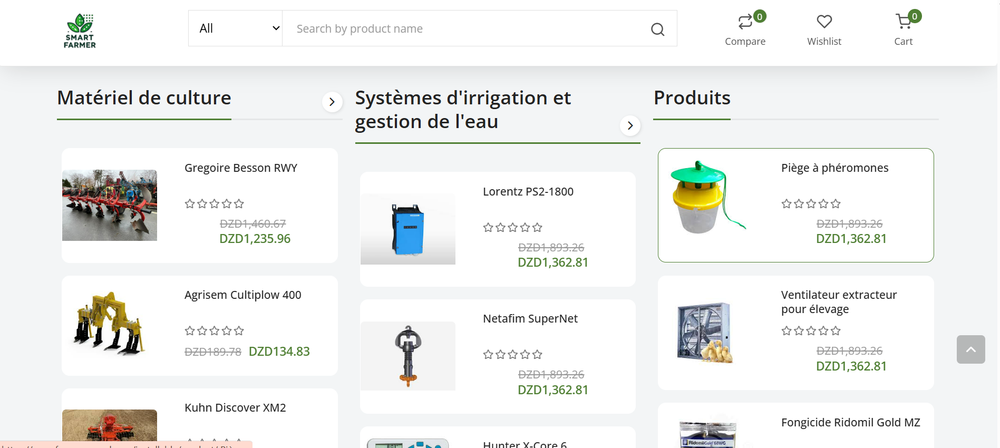
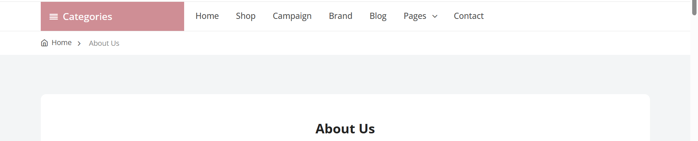

# 👕 T-Shirt Market – Plateforme de Vente et Achat de T-Shirts Personnalisés

**T-Shirt Market** est une application web qui permet aux utilisateurs de **vendre, acheter** et **créer** des T-shirts personnalisés. Elle offre une interface intuitive pour découvrir des vêtements uniques, publier ses propres créations et commander en toute simplicité.

---

## Fonctionnalités :

- 🛍️ Vente de T-shirts personnalisés : ajout facile de produits avec images, description et prix.
- 🔎 Recherche intelligente : filtres par style, taille, prix, couleur et popularité.
- 🎨 Personnalisation : possibilité de télécharger un design pour impression à la demande.
- 📦 Gestion des commandes : suivi des achats et des ventes en temps réel.
- 💳 Paiement sécurisé : prise en charge des principales méthodes de paiement.

---

## Aperçu visuel de l'application

---

## Objectif :
Créer un espace dynamique où les créateurs et passionnés de mode peuvent **échanger facilement** autour de T-shirts personnalisés, tout en promouvant la **créativité** et le **commerce local ou en ligne**.

---

## Lien de l'application :
[Accéder à T-Shirt Market](https://www.fennecpannel.com/fares/) *(modifie ce lien si nécessaire)*

---

## Technologies :
- Frontend : HTML/CSS/JS ou React/Vue *(à adapter)*
- Backend : Node.js / Flask / Firebase *(à adapter)*
- Base de données : Firebase / MongoDB / SQL

---

## Auteur :
Développé par [fares-chaima](https://github.com/fares-chaima)
